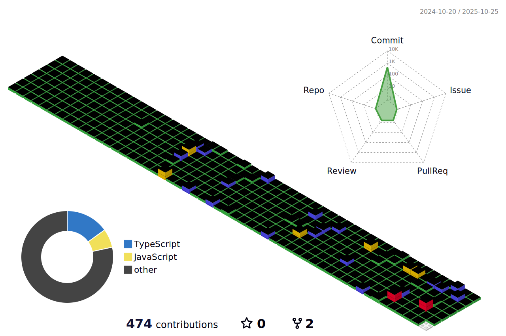

###

<!--
**Ina-dang/Ina-dang** is a ✨ _special_ ✨ repository because its `README.md` (this file) appears on your GitHub profile.

Here are some ideas to get you started:

- 🔭 I’m currently working on ...
- 🌱 I’m currently learning ...
- 👯 I’m looking to collaborate on ...
- 🤔 I’m looking for help with ...
- 💬 Ask me about ...
- 📫 How to reach me: ...
- 😄 Pronouns: ...
- ⚡ Fun fact: ...
-->

</image>

<h3 align=center> 
🌱 Hello🖐 I’m Ina from Seoul, Korea.
</h3>

I used to major in music and psychology,but now I'm a front-end developer!

 

	

<h3 align="center">📚 Tech Stack 📚</h3>

	
	
	
	
	
	
	 
 	
 	

	

	

	<h3> 🐣 Social 🐣 </h3>	
	
	

  

